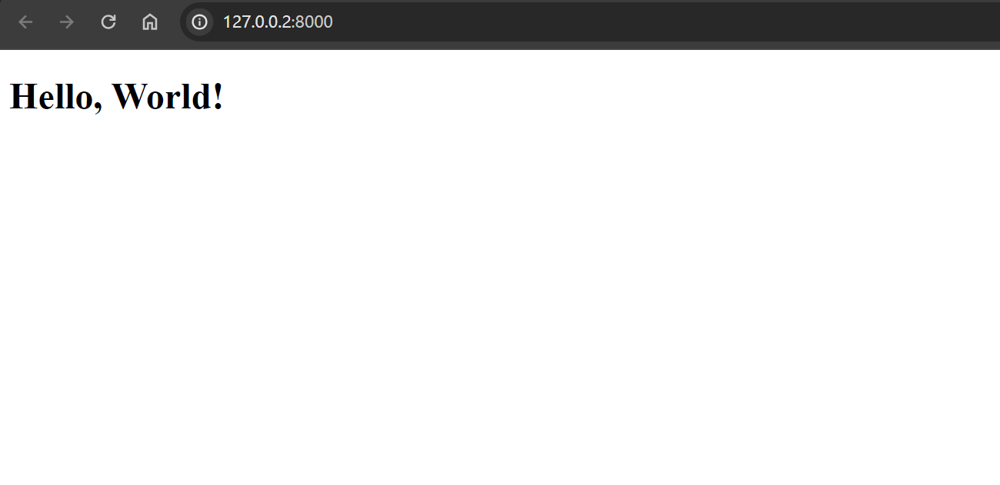
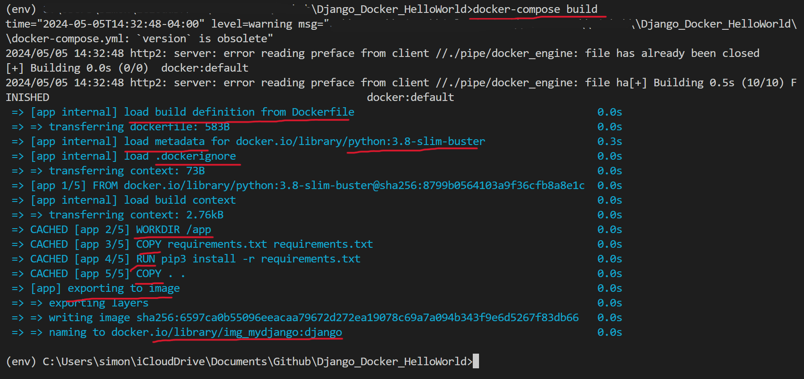
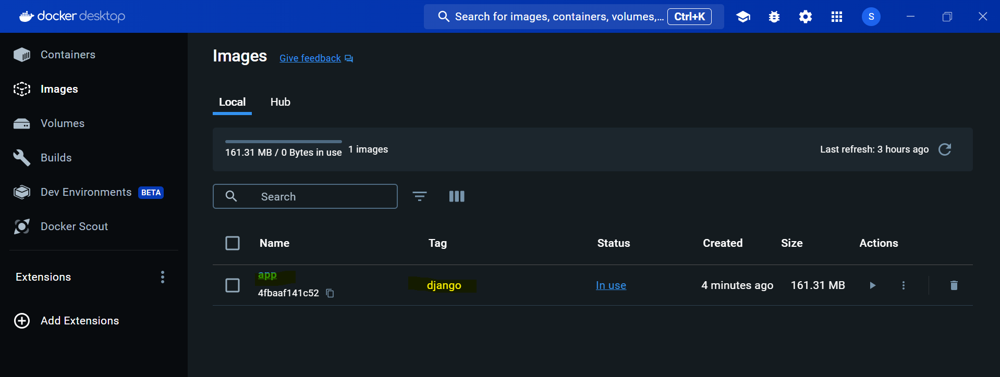
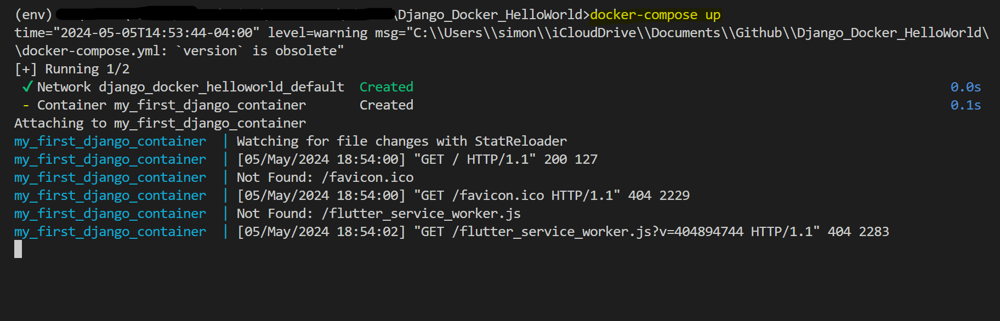
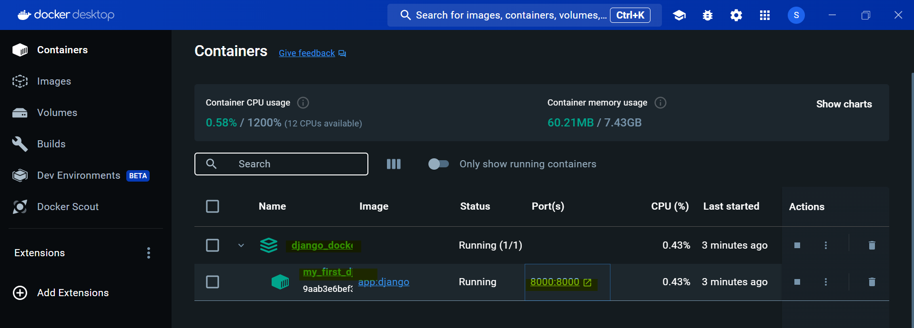
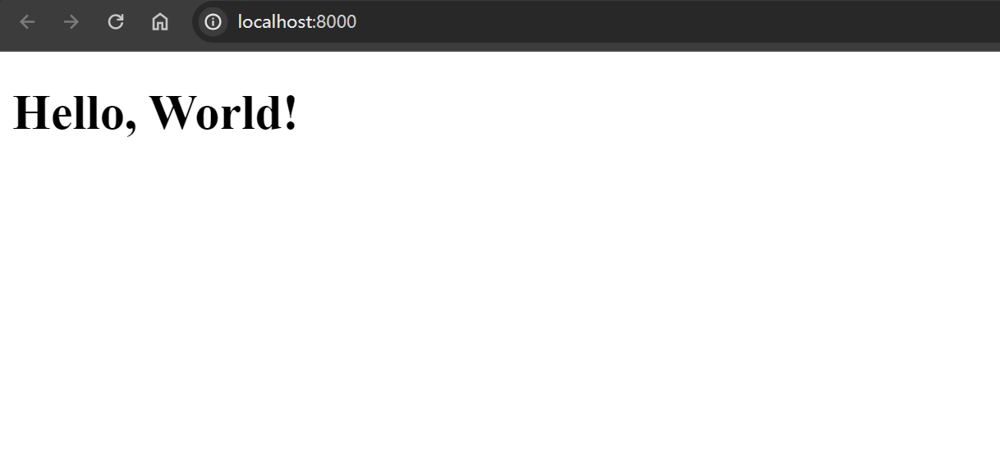

# Django&Docker: Hello World

A repo to learning dockerize a hello world Django application.

- Dockerfile reference
  - https://docs.docker.com/reference/dockerfile/

---

## Create Django Hello world application



---

## Create Docker File

create `.dockerignore` file to exclude the unnecessary files.

```conf
env/
.vscode/
README.md
pic/
```

## Create a Docker Image

- use a docker-compose.yml

```yml
# Specify the version of the Docker Compose file format.
version: "3.9"

services:
  # Define a service named 'app'.
  app:
    # Build the Docker image from the Dockerfile in the current directory (root).
    build: .
    # Mount the current directory on the host to the '/django' directory in the container.
    volumes:
      - .:/django
    # Map port 8000 on the host to port 8000 on the container, allowing access to the app.
    ports:
      - 8000:8000
    # Use the specified Docker image name
    image: app:django
    # Set the container's name
    container_name: my_first_django_container
    # Run the Django development server on all network interfaces at port 8000.
    command: python manage.py runserver 0.0.0.0:8000
```

- build the Docker images for services defined in a Docker Compose file (docker-compose.yml).

```sh
# to build the docker image
docker-compose build
```





start the services defined in a Docker Compose file (docker-compose.yml). It does several things to bring your multi-container application online:

```sh
docker-compose up
```






